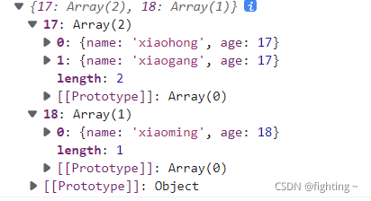

# 对象

## 理解对象

### 4 个数据属性

1. Configrable 属性是否可删除, 是否课修改特性, 是否能改成**访问器属性**
2. Enumerable 是否能够通过 for-in 循环返回
3. Writerable 是否能被修改
4. Value 属性实际的值

#### 注意: 

- 默认情况下都为 true, 但如果调用`Object.defineProperty()`, 即使不设置, 数据属性都变为 false

- 非严格模式下, 即便数据属性设置为 false, 比如此时再修改属性会被忽略; 但在严格模式下, 会报错

### 4 个访问器属性

1. Configrable 属性是否可删除, 是否课修改特性, 是否能改成**数据属性**
2. Enumerable 是否能够通过 for-in 循环返回
3. Get 获取函数, 在读取属性时调用, 默认返回 undefined
4. Set 获取函数, 在修改属性时调用, 默认返回 undefined

### 定义属性API

1. 定义单个属性: Object.defineProperty(对象, '属性名', {属性信息})
2. 定义多个属性: Object.defineProperties(对象, { 属性名:{属性信息} })

### 读取属性API

Api: `Object.getOwnPropertyDescriptors()`

描述: 以对象的形式获取属性的数据属性和访问器属性

### 获取对象属性和属性值API

1. 获取键与值: Object.keys(), Object.values()
2. 获取键值对的数组: Object.entries()  

```js
const o = {
  foo: 'bar',
  baz: 1,
  qux: {}
}
console.log(Object.entries(o)) // [["foo", "bar", ["baz": 1], ["qux", {}]]
```

### 解构赋值注意点

1. 如果解构属性中存在复杂数据类型, 则主要要进行拷贝处理(不然地址依然指向同一块, 比如函数或者对象)

2. 每一种字面量也可以解构, 比如 

   ```js
   let { constructor: c } = 4; 
   
   console.log(c === number) // true
   ```

3. 解构中这种操作是给属性重新命名

   ```js
   let {name : personName, age: personAge} = person
   ```

## 创建对象

### 构造函数模式

注意: 工厂模式没有解决对象标识问题(即新创建的对象是什么类型), 因此才引出构造函数模式

```js
// 工厂模式举例
function createPerson(name, age ,job){
  let o = new Object()
  o.name = name 
  o.age = age
  o.job = job
  o.sayName = function(){
    console.log(this.name)
  }
  return o
}
let person1 = createPerson('Nicholas', 29, 'front')

// 构造函数举例
function Person(name, age, job){
  this.name = name
  this.age = age
  this.job = job
  this.sayName = function(){
    console.log(this.name)
  }
}
let person1 = new Person('Nicholas', 29, 'front')
```

### new 关键字作用

1. 在内存中创建一个新对象
2. 这个新对象内部的**[[Prototype]]**特性被赋值为构造函数的 prototype 属性([[Prototype]] 为指针, 并不能通过 js 对象点语法直接获取)
3. 构造函数内部的 this 被赋值为这个新对象
4. 执行构造函数内部的代码(给新对象添加属性)
5. 如果构造函数返回非空对象, 则返回对象; 否则返回 new 创建的对象

### 原型模式

可以解决构造函数由于定义的复杂数据, 在每次实例创建时都开辟新的内存空间, 而原型模式能将复杂数据存储在原型中, 用于复用

#### 获取原型API

API: `Object.getPrototypeOf(person1)`

描述: 能够获取实例的原型

#### Instanceof 用法

描述: 用来判断**右边的原型**是否在**左边的原型链**中

```js
function Person(){
  this.name="wang";
}
var p1=new Person();
console.log( p1 instanceof Person); //true
// 等价于
console.log(Person.prototype.isPrototypeOf(p1)); //true
```

## 补充

### reduce用法

#### 语法

**特点**: reduce() 可同时将前面数组项遍历产生的结果与当前遍历项进行运算(也就是每一次迭代结果能参与下一次迭代)

```js
// 其中有 5 个参数, 只有 prev,cur 为必须, 其他为可选
arr.reduce(function(prev,cur,index,arr){
...
}, init);
```

#### 参数

1. prev 必需。累计器累计回调的返回值; 表示上一次调用回调时的返回值，或者初始值 init;
2. cur 必需。表示当前正在处理的数组元素；
3. index 可选。表示当前正在处理的数组元素的索引，**若提供 init 值，则起始索引为- 0，否则起始索引为1；**
4. arr 可选。表示原数组；
5. init 可选。表示初始值。

#### 举例

```js
// 若提供 init 值，则起始索引为- 0，否则起始索引为1；**
// 1. 没有初始值时, 迭代了 4 次
const arr = [1,2,3,4,5];
const sum = arr.reduce(function(prev,cur,index,arr){
    console.log(prev,cur,index);
    return prev + cur;
});
console.log('arr:',arr,'sum:',sum);

```


```js
// 2. 有初始值时, 迭代了 5 次, (初始值 5, 也就是第一次迭代中的 prev, 第一次迭代中数组的第一个数就成了 cur, index 为 0)
const arr = [1,2,3,4,5];
const sum = arr.reduce((prev,cur,index,arr) => {
    console.log(prev,cur,index);
    return prev + cur;
},5); 
console.log('arr:',arr,'sum:',sum);
```


#### 应用场景

```js
// 1. 计算数组中每个元素出现的次数
var names = ['Alice', 'Bob', 'Tiff', 'Bruce', 'Alice', 'Bob', 'Bob'];
var countedNames = names.reduce(function (allNames, name) {
  console.log(allNames,name);
  if (name in allNames) {
    allNames[name]++;
  }
  else {
    allNames[name] = 1;
  }
  return allNames;
}, {});
console.log(countedNames);
```


```js
// 2. 去除数组中重复的元素
// 这里的处理思路是先排序, 在每次迭代时判断新进来的数是否和当前数组的最后一个数相同, 如果不同, 则添加(因此当相同的时候就就不同添加进数组)
let arr = [1,2,1,2,3,5,4,5,3,4,4,4,4];
let result = arr.sort().reduce((init, current) => {
    if(init.length === 0 || init[init.length-1] !== current) {
        init.push(current);
    }
    return init;
}, []);
console.log(result);
```

```js
// 3. 按属性对Object分类
var person = [
    {
        name: 'xiaoming',
        age: 18
    },{
        name: 'xiaohong',
        age: 17
    },{
        name: 'xiaogang',
        age: 17
    }
];
function groupBy(objectArray, property) {
  return objectArray.reduce(function (acc, obj) {
    var key = obj[property];
    if (!acc[key]) {
      acc[key] = [];
    }
    acc[key].push(obj);
    return acc;
  }, {});
}
var groupedPerson = groupBy(person, 'age');
console.log(groupedPerson);
```



# 类

## 类函数的原型

```js
// 类函数挂载方法的两种方式, static 关键字定义静态类方法将方法定义在类本身, 也就是说每次创建实例需要开辟空间; 直接在 constructor() 平级写方法, 不用你 static 关键字默认挂载到原型上, 当然也可以通过点语法挂载
class Person{
  constructor(){
    this.locate = () => console.log('instance', this)
  }
  // 定义在类的原型对象上
  locate(){
    console.log('prototype', this)
  }
  // 定义在类本身上
  static locate(){
    console.log('class', this)
  }
}
```

## super 关键字

```js
class B extends A{
    constructor(){
        super(); 
    }
}
```

**作用**: 派生类(即子类, 这里的子类为 B)在`constructor`中必须调用`super`方法，因为子类没有自己的`this`对象，而是继承父类的`this`对象，而`super`就代表了父类的构造函数。`super`内部的`this`指的是B. 

1. 使派生类能够调用父类构造函数
2. 使派生类 this 能够指向本身(派生类如果不调用 super() 那么就 this 没有指向)

**注意**: 

1. 派生类不要在调用super()之前引用 this, 否则会抛出 ReferenceError

2. 静态方法中能够能通过 super 调用父类上定义的静态方法

   ```js
   class Vehicle(){
   	static identify(){
   		console.log('vehicle')
   	}
   }
   
   class Bus extends Vehicle {
   	static identify(){
   		super.identify() // 在这里调用父类的静态方法
   	}
   }
   ```

3. super 只能在派生类构造函数和静态方法中使用

4. 不能单独引用 super 关键字(比如说打印 super), 要么用他调用构造函数, 要么引用静态方法

