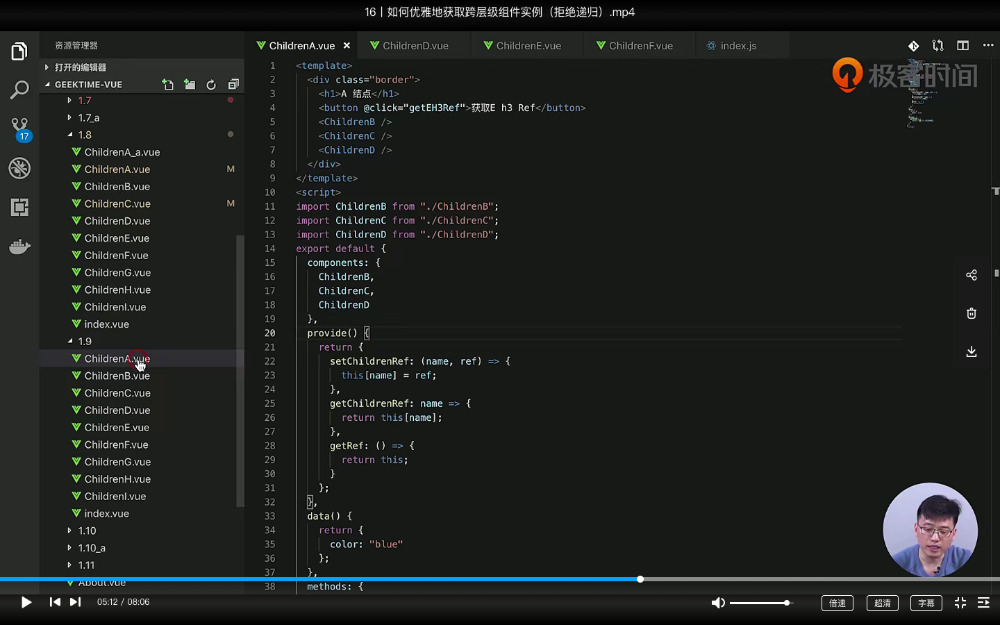
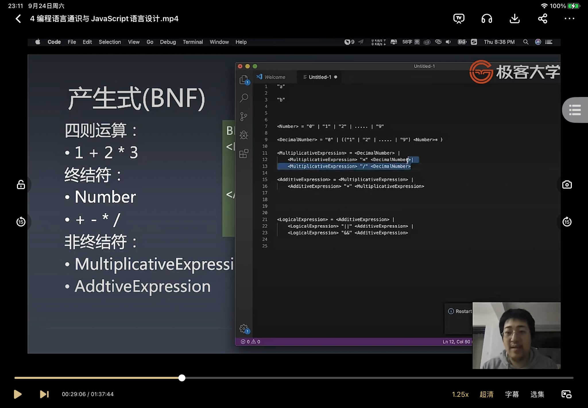

1. **跨层级获取组件实例**(下载包 vue-ref), 在祖先组件中将子组件实例获取并缓存, 并利用provide抛出, 在子组件中利用inject获取当前父组件的实例

2. **知识体系**很重要, 不然学再多东西都是在垃圾上堆东西, 所以过一阵子就需要整理知识
3. **前端三大能力**: 编程能力  架构能力  工程能力(工程能力不好, 项目交付质量不可能会好)

作业：运用**追溯法**查概念: 面向对象

技术知识平台——

1、whatwg.org

2、ecma-international.org

3、w3.org

**问题**: 严格模式下有什么特点?

BNF 产生式（定义数字，表达式，运算。。。）

\<Number>  = "0" | "1" | ...... | "9"

\<DecimalNumber> = "0" | (("1" | "2" | ...... | "9")  \<Number>* )

\<Expression> = \<DecimalNumber> | \<DecimalNumber> "+" \<DecimalNumber>

