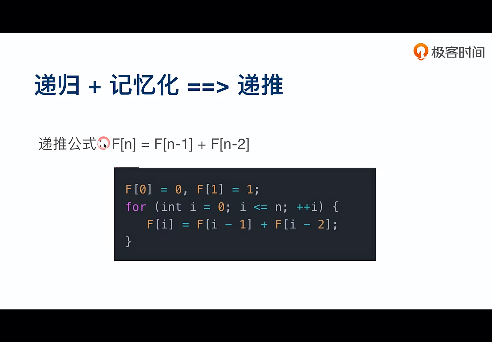

## 1. 学习数据结构方法论与认知

### 数据结构分类和关系图


### 数据结构刻意练习方法论


#### **查阅**： 整理数据结构和算法的总体框架、知识地图


### 时间复杂度

**注意**：在写算法题时，要想想所有可能的解法，同样的解答时间复杂度越低，效果越好，也就是说在面试中的算法题考的就是对于代码中时间复杂度的理解，并不只是解答出来问题就行（之前经历过的面试中，虽然有些地方解答了出来，但都是运用的多层循环嵌套，也就违背了这个原则，如此看来，算法的目的在于此，找到问题的最优解法）


### 常见算法复杂度


**刷题平台**：LeetCode

## 2. 理论部分及对应案例

### 数组与链表(206、24、141、142、25)

1. 数组查找的时间复杂度为 o(1), 插入和删除的时间复杂度为 o(n) (如果插到最后则为 o(1))

2. 链表的插入和删除为时间复杂度为 o(1), 但查找的时间复杂度为 o(n)

   ### 单链表

   ### 双链表

   

#### 常见数组与链表算法习题


##### reverse-linked-list


##### Swap-node-in-pairs


##### linked-list-cycle


### 堆栈和队列（Stack Queue）(20、232、255)

堆栈：先入后出

队列：先入先出


### 优先队列(703、239)


### 二分查找(69)

#### 数据源特点 

1. Sorted 单调递增或者递减
2. Bounded 存在上下界
3. Accessible by index 能够通过索引访问

#### 时间复杂度: log(n)

#### 代码模板


#### sqrt(y)

#### 

#### 代码实现及注意

注意: 

1. 这里的 mid 除了之后可能是小数, 所以需要转成整数; 
2. 注意 mid的赋值操作要放到 while 循环中, 不然 mid 就成了死数据, 但实际上需要每次进行变更
3. 然后判断条件不要写反了, 当 num 大于中值的时候, 需要给左边的变量赋值; 
4. 每一次给下标赋值, 需要加一或减一, 用来排除已经参与比较的数

```js
function twoPartSearch(arr, num) {
    let left = 0
    let right = arr.length - 1
    while (left <= right) {
        let mid = Math.floor((left + right) / 2)
        console.log(mid, right, left);
        if (num < arr[mid]) {
            right = mid - 1
        }
        if (num > arr[mid]) {
            left = mid + 1
        }
        if (num === arr[mid]) {
            return true
        }
    }
    return false
}
console.log(twoPartSearch([1, 3, 5, 7, 12, 22, 143, 234], 143)); // true
```


### 快速排序

#### 描述

利用分而治之(D&C: divide and conquer) 的递归式问题解决方法

1. 找出极限条件, 这种条件必须尽可能简单
2. 不断将问题分解, 知道符合基线条件

#### 代码实现及注意

注意这段代码中不要将 baseLine 也 push 到左右数组中, 不然会死循环

```js
function fastSort(arr) {
    let leftArr = []
    let rightArr = []
    let baseLine = arr[0]
    if (arr.length <= 1) return arr
    for (let i in arr) {
        if (arr[i] < baseLine) {
            leftArr.push(arr[i])
        }
        if (arr[i] > baseLine) {
            rightArr.push(arr[i])
        }
    }
    return fastSort(leftArr).concat([baseLine], fastSort(rightArr))
}

console.log(fastSort([10, 23, 5, 2, 4, 35, 6, 76]));  //[ 2,  4,  5,  6, 10, 23, 35, 76 ]
```

### 广度优先搜索(102)

地毯式搜索: 以根节点为起点, 一层层向内搜索 

#### 代码实现及注意

```js
function breadthFirstSearch(node) {
           var nodeList = [];
           if (node != null) {
               var queue = [];
               queue.unshift(node);  //进入队列
               while (queue.length != 0) {
                   var item = queue.shift();  //离开队列
                   nodeList.push(item);
                   var children = item.children;
                   for (var i = 0; i < children.length; i++)
                       // 依次将该层的子元素放到队列中
                       queue.push(children[i]);
               }
           }
           /* 将最终遍历结果存放在nodeList数组中。*/
           return nodeList;
       }
       let root = document.getElementById('root')
       var nodeList = breadthFirstSearch(root)
       console.log(nodeList);
```


### 深度优先搜索

从一条线走到底, 再从另一条走到底


#### 代码实现及注意

这段代码的实现是首先将根节点压入栈中, 再获取到根节点的下一层子节点(注意这里的 for 循环是从最后一个dom 开始往回获取), 配合 pop 实现节点的深度遍历, 直到 stack 中没有节点为止, 结束循环

```html
// 非递归的方式实现深度优先遍历
<!DOCTYPE html>
<html lang="en">
<head>
    <meta charset="UTF-8">
    <meta http-equiv="X-UA-Compatible" content="IE=edge">
    <meta name="viewport" content="width=device-width, initial-scale=1.0">
    <title>Document</title>
</head>
<body>
    <div id="root">
        <ul>
             <li>
                 <a href="">
                     
                 </a>
             </li>
             <li>
                 <span></span>
             </li>
             <li>
             </li>
         </ul>
         <p></p>
         <button></button>
     </div>
</body>

<script>
	// 深度优先遍历
    function deepFirstSearch(node) {
           var nodeList = [];   //下方存放弹栈节点的容器
           if (node != null) {
               var stack = [];   //上方栈结构
               stack.push(node);
               while (stack.length != 0) {
                   var item = stack.pop(); // 出栈，先弹出左边的子节点
                   nodeList.push(item);
                   var children = item.children;
                   for (var i = children.length - 1; i >= 0; i--){
                       // 入栈顺序为：子节点从右向左入栈
                       stack.push(children[i]);
                   }
               }
           }
           /* 将最终遍历结果存放在nodeList数组中。*/
           return nodeList;
       }
       let root = document.getElementById('root')
       var nodeList = deepFirstSearch(root)
       console.log(nodeList);
</script>
</html>
```

```js
// 递归方式的方式实现深度优先遍历
// 递归中一定要注意结束标志是什么!!!
	function deepFirstSearch(node, nodeList) {
	 if (node) {
	     nodeList.push(node);
	     var children = node.children;
	     for (var i = 0; i < children.length; i++)
	         //每次递归的时候将 需要遍历的节点 和 节点所存储的数组nodeList传下去
	         deepFirstSearch(children[i], nodeList);
	 }
	 return nodeList;
	}
```

#### 比较


### 贪心算法(122)

思路: 从局部最优的角度触发思考, 所以不能兼顾全局最优 (这个代码实现很简单)


#### 代码实现及注意

```js
// 这里是丢进去一个数组, 炒股票的案例
var maxProfit = function(prices) {
    let ans = 0;
    let n = prices.length;
    for (let i = 1; i < n; ++i) {
        ans += Math.max(0, prices[i] - prices[i - 1]);
    }
    return ans;
};
```

### 递归(50, 169)

#### 斐波那契数列递归算法


#### x 的 y 次方递归代码实现

```js
// 1. x 的平方递归代码实现(时间复杂度为O(n))
function x2(x, y) {
    y--
    if (y === 0) {
        return x
    }
    return x * x2(x, y)
}
console.log(x2(2, 3));

// 2. x 的平方递归代码实现(时间复杂度为 O(logn))
// 注意这里需要判断幂次的奇偶性, 偶数用 x*x 进行迭代, 如果为奇数则需要乘 x
var myPow = function(x, n) {
    if(n ==0 || n ==1) {
        return n ==0 ? 1: x
    }else if(n < 0){
        return myPow(1/x, Math.abs(n))
    }else{
        return n % 2 == 0 ? myPow(x * x , n/2) :  myPow(x * x ,Math.floor(n/2))* x
    }
};
```

### 动态规划(70, 120, 152)

描述: 递推 = 递归 + 记忆化

注意: 这里依然还是斐波那契数列为例子, 但是加了一个 F[i] 赋值的步骤, 用来在内存当中缓存第一次计算的值, 在后面递归过程中如果判断已经计算过, 那么就直接取用内容当中已经计算好的值, 使得时间复杂度降至O(n), 而没有缓存的递归时间复杂度为 O( 2^n)



```js
//1、递归写法(时间复杂度O(2^n))
function jumpFloor(n){
    if(n==1) return 1;
    else if(n==2) return 2;
    return jumpFloor(n-1)+jumpFloor(n-2);
}

//2、记忆化递归（保存中间结果）(时间复杂度O(n))
//对于cache数组，cache[n]就表示缓存的f(n)的结果
let cache=[0,1,2];
function jumpFloor2(n){
    //也就是我们在找f(n)的值的时候，如果缓存里面有，直接用缓存
    if(cache[n]!==undefined) return cache[n];
    return cache[n]=jumpFloor2(n-1)+jumpFloor2(n-2);
}
```

#### 举例

小人从左上角到右下角有多少种走法(其中红色区域为石头, 并且每次只能往右或者往下走一格)

其中的绿色箭头处的 3 表示从那处格子到右下角有 3 种走法(这里用的是倒推法, 由于最下面一行和最右边一列都只有一种情况到达终点, 所以格子中数字都为 1 , 其他数字为右边和下边格子数字之和)


依次递推得出从起点除总共有 27 种行走方式到达终点


#### 例题:三角形的最小路径和(120)

```js
// 题目描述:给定一个三角形 triangle ，找出自顶向下的最小路径和。
// 每一步只能移动到下一行中相邻的结点上。就是说只能往下一层最近的两个节点选一个走
// 思路: 用倒推法实现递推, 从倒数第二行开始, 其中某一节点 triangle[i][j] 由自身数值加上下一层临近两个节点中最小值
let minimumTotal = function (triangle) {
    for (let i = triangle.length - 2; i >= 0; i--) {
        for (let j = 0; j < triangle[i].length; j++) {
            triangle[i][j] = Math.min(triangle[i + 1][j], triangle[i + 1][j + 1]) + triangle[i][j];
        }
    }
    return triangle[0][0];
};

console.log(minimumTotal([[2], [3, 4], [6, 5, 7], [4, 1, 8, 3]])); 
// 最后的 triangle = [ [ 11 ], [ 9, 10 ], [ 7, 6, 10 ], [ 4, 1, 8, 3 ] ]
```

#### 例题: 乘积最大子数组(152)

```js
// 题目描述:给你一个整数数组 nums ，请你找出数组中乘积最大的非空连续子数组（该子数组中至少包含一个数字），并返回该子数组所对应的乘积。
var maxProduct = (nums) => {
    let res = nums[0]
    let prevMin = nums[0]
    let prevMax = nums[0]
    let temp1 = 0, temp2 = 0
    for (let i = 1; i < nums.length; i++) {
        temp1 = prevMin * nums[i]
        temp2 = prevMax * nums[i]
        prevMin = Math.min(temp1, temp2, nums[i])
        prevMax = Math.max(temp1, temp2, nums[i])
        res = Math.max(prevMax, res)
    }
    return res
}

console.log(maxProduct([2, 3, -2, 4])) // 6
```

